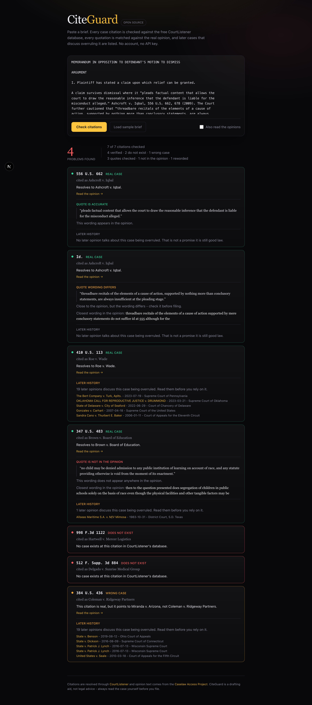

# CiteGuard

Paste a legal brief. CiteGuard checks that every case exists, that every
quotation is really in the opinion, and that no later court has talked about
overruling it.

No account. No API key. Runs on your own machine.



## The problem

Lawyers keep getting sanctioned for filing briefs that cite cases which were
never decided. An AI assistant invents a case name, a volume and a page number,
the citation looks perfectly normal, and nobody notices until a judge tries to
read it.

Worse, the fake citation is not even the most common offence. Roughly a quarter
of documented sanction incidents are quotes: the case is real, the citation is
real, and the sentence in quotation marks was never written by that court. Those
draw the larger fines, because a made-up case reads like a mistake and a made-up
quote reads like a lie.

None of these checks are hard. They are just tedious enough that under deadline
pressure they get skipped.

## What it checks

Every citation gets four questions asked of it, plus one optional fifth:

1. **Does this case exist?** The citation is resolved against
   [CourtListener](https://www.courtlistener.com), which holds over 18 million
   citations. A citation that resolves to nothing is reported as fabricated.
2. **Is it the case you named?** A real citation attached to the wrong case name
   is reported as misattributed - for example a brief citing
   `Coleman v. Ridgeway Partners, 384 U.S. 436` when that citation is actually
   Miranda v. Arizona.
3. **Is the quote really in the opinion?** Every quotation near a citation is
   matched against the actual opinion text. A quote that is there comes back
   accurate; a quote whose wording drifted comes back with the real sentence
   printed beside it; a quote with no counterpart anywhere in the opinion comes
   back as not in the opinion.
4. **Has a later court talked about overruling it?** Later opinions that cite
   this case *and* use the word overruled about it by name are listed with links.
   Roe v. Wade in the sample brief returns nineteen.
5. **Does the case say what you claim?** Optional. A local language model reads
   the opinion and reports whether it supports the sentence in your brief.

Checks 1 to 4 run without any model at all. Check 5 is slower because it runs on
your own hardware, so it is opt-in.

## Where the data comes from

| Need | Source | Key required |
| --- | --- | --- |
| Does the citation resolve to a case | CourtListener citation redirect | no |
| Later opinions citing it | CourtListener search API | no |
| Full text of the opinion | [Caselaw Access Project](https://case.law) static mirror | no |
| Reading the opinion | [Ollama](https://ollama.com) on localhost | no |

Nothing you paste leaves your machine except the volume, reporter and page
number of each citation, and the party names of cases that resolved.

## Run it

```bash
npm install
npm run dev          # http://localhost:4622
```

That is the whole install. The two optional pieces below each add something, and
nothing breaks if you never start them.

**Better citation extraction (Python).** The built-in extractor is a regex and
misses `Id.` and `supra` back-references. Start the eyecite service and those get
picked up and tied back to the case they refer to:

```bash
cd service
python3 -m venv .venv && .venv/bin/pip install -r requirements.txt
.venv/bin/uvicorn main:app --port 4623
```

The app finds it automatically. Point elsewhere with `CITEGUARD_EXTRACTOR`.

**Opinion reading (Ollama).** For check 5:

```bash
ollama pull qwen2.5:14b
```

Override the model with `CITEGUARD_MODEL`, or point at a remote Ollama with
`OLLAMA_HOST`.

```bash
npm test                              # unit tests, no network
cd service && .venv/bin/python test_extract.py
```

## Limits worth knowing

- Caselaw Access Project coverage ends around 2020, so the quote check and the
  opinion-reading check are unavailable for very recent cases. The existence
  check still works.
- Only US reporters are recognised. The list is at the top of
  [`lib/citations.ts`](lib/citations.ts) and takes one line to extend.
- A citation is only called fabricated when CourtListener returns a definite
  404. Anything else is reported as "not checked" rather than risking a false
  accusation.
- Only an exact match earns "quote is accurate". Similarity scores are not
  trusted to wave a quote through, because dropping a "not" into a long sentence
  reverses the holding while barely moving the score.
- Later history is a **reading list, not a verdict**. The same search returns
  nineteen opinions for Roe, which was overruled, and nineteen for Miranda, which
  was not - the second set is courts arguing about whether Congress could
  overrule it. No count can tell those apart, so CiteGuard points you at the
  opinions instead of pretending to judge them.
- Parallel citations (`93 S. Ct. 705` alongside `410 U.S. 113`) are each checked
  separately.

CiteGuard is a drafting aid, not legal advice. Read the case before you file.

## Licence

MIT
